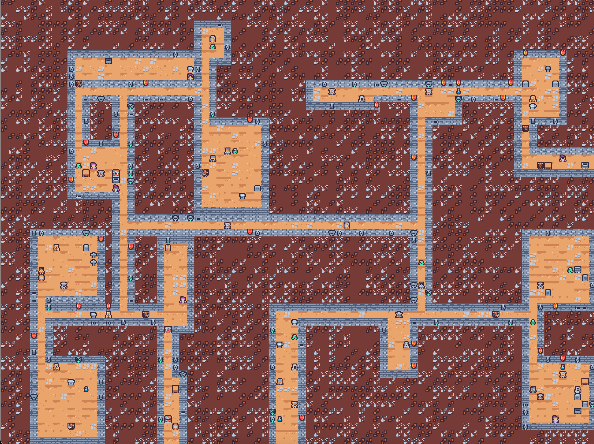
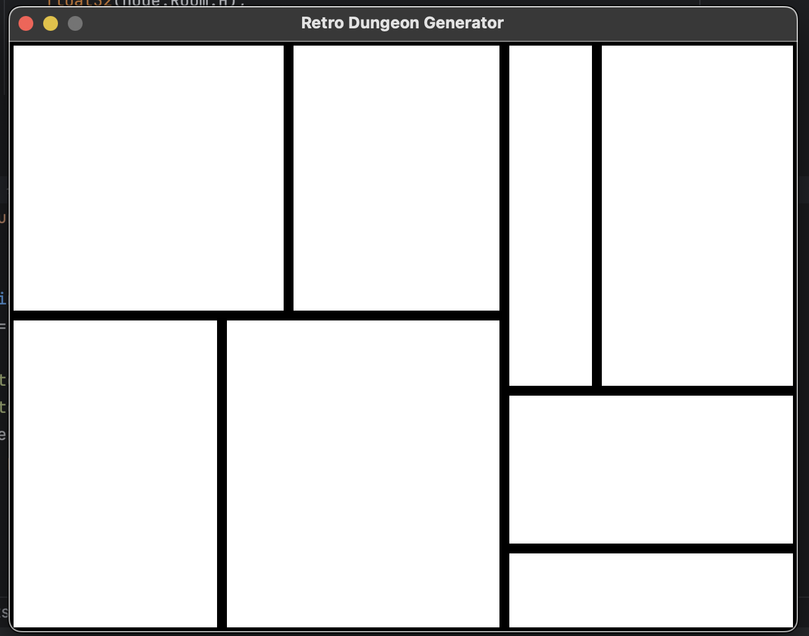
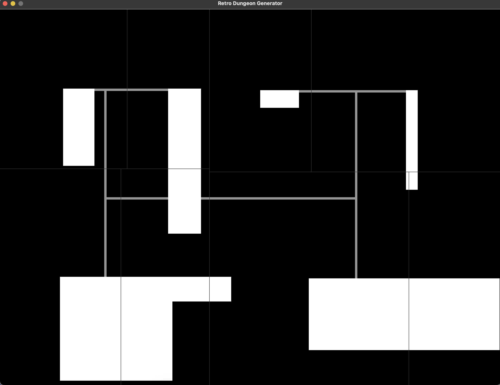
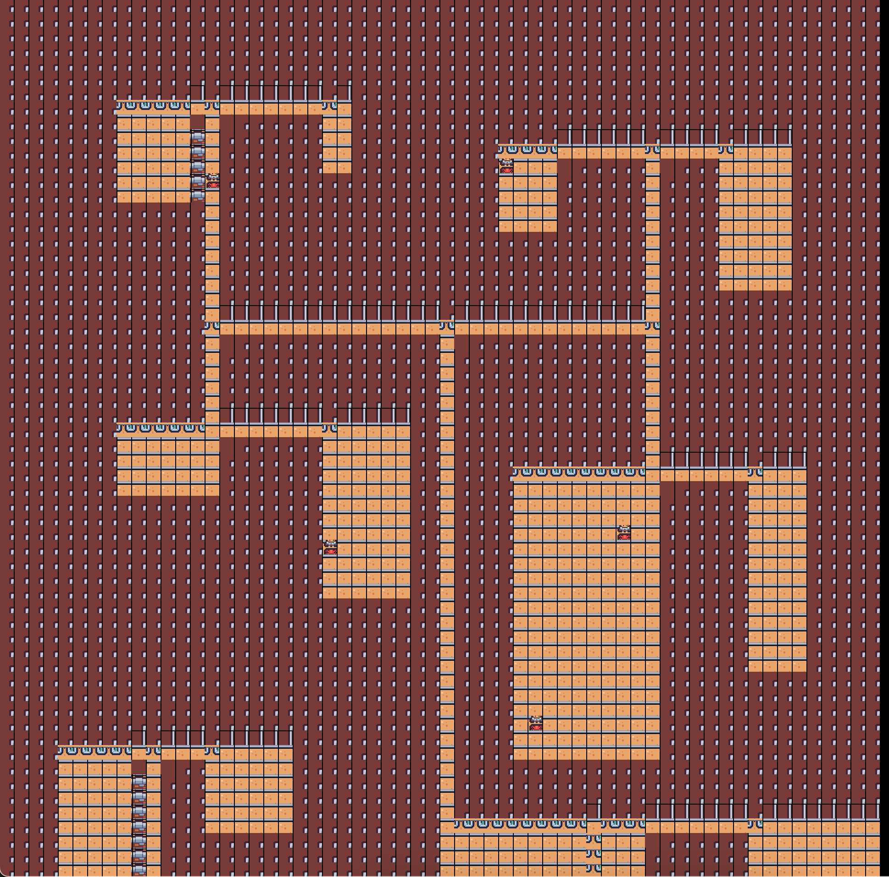
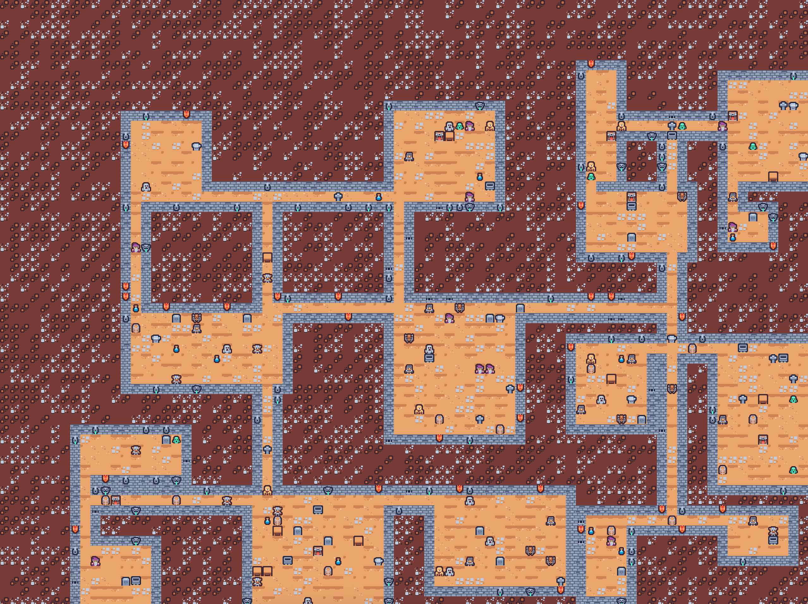

# DeepGo Dungeon

A **Procedural Dungeon Generator** built in Go using the Ebitengine game framework. I also use Binary Space Partitioning (BSP) and a modular asset-loading system to create randomized, retro-styled layouts.



##  The Vision

I couldn't find any straightforward implementations of BSP algorithms, nonetheless, in Golang. Therefore,
the goal was to build a "game-adjacent" tool that handles the complex math of dungeon generation while maintaining
a chunky pixel aesthetic.

## How it Works: The BSP Split


### 1. The BSP Split
The generator follows a recursive process to ensure unique layouts:
- **Split:** The world starts as one large rectangle and is recursively split into smaller "containers" based on a random percentage.
- **Ratio Control:** To prevent "sliver" rooms, the algorithm forces splits in the opposite direction if a container becomes too narrow or tall.
- **Carve:** Once a set depth is reached, rooms are carved with randomized padding.
- **Connect:** Hallways connect sibling nodes via their centers, ensuring every room is reachable.

### 2. Multi-Pass Visual Generation
Instead of a single spritesheet, I use a modular directory system:
- **Grid Mapping:** Converts the raw coordinate math into a grid of tile indices with metadata.
- **Auto-Tiling:** Automatically detects boundaries to place `Wall` tiles wherever a `Void` touches a navigable path.
- **Deterministic Variety:** Picks random tile variants from directory pools (`room/`, `wall/`, `void/`) once during generation to ensure a stable, non-flickering image.
- **Layered Decorators:** Implements a secondary pass to overlay floor clutter (skeletons, mushrooms) and wall details (banners, torches) with randomized weights.

## Getting Started

### Installation

1. Clone the repo:
```bash
git clone https://github.com/owenHochwald/deepgo-dungeon.git
cd deepgo-dungeon
go mod tidy # install deps
go run main.go # build and run
```

# Photos and Iterations




